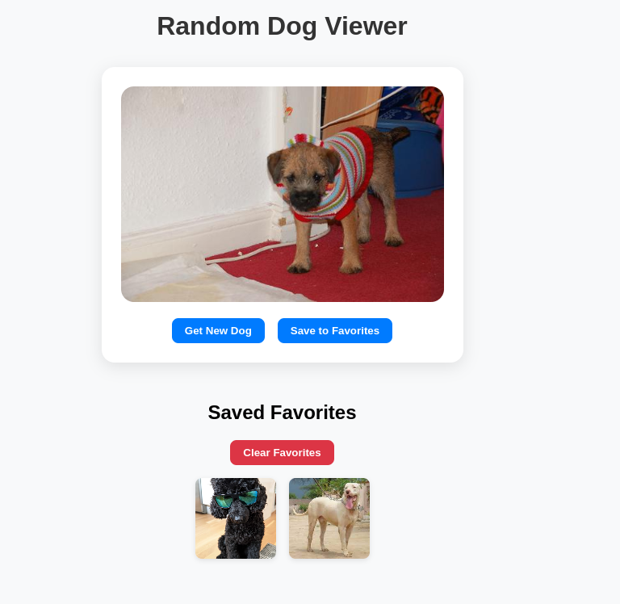

# React Simple Data Fetching Lab

This is a beginner-friendly React app that demonstrates how to fetch data from an external API using the `useEffect` hook, manage state with `useState`, and build a more interactive, responsive, and engaging user experience.



---

## Learning Goals

- Use the `useEffect` hook to fetch data on component mount
- Manage loading and data state with `useState`
- Display a loading indicator during fetch
- Render fetched data (dog image)
- Improve user experience through interactivity and design enhancements

---

## Features

**Fetch Random Dog Images**  
Fetches images from the [Dog CEO API](https://dog.ceo/dog-api/) on page load and via a button.

**Loading Spinner**  
Displays an animated spinner while the API is fetching data.

**Interactive Buttons**  
- **Get New Dog** — Fetch a new random image
- **Save to Favorites** — Save your favorite dogs

**Favorites Gallery**  
- Shows all saved dog images
- Saves favorites in **localStorage**
- Includes a **Clear Favorites** button

**Responsive and Clean UI**  
- Styled using basic CSS
- Responsive layout with card UI and gallery

---

## Setup Instructions

1. Clone the repository:
   ```bash
   git clone https://github.com/AmedDavid/random-dog.git
   cd random-dog
   ```

2. Install dependencies:
   ```bash
   npm install
   ```

3. Start the development server:
   ```bash
   npm start
   ```

4. Visit in browser:  
   `http://localhost:3000`

---

## Issues Faced During Development

- **Infinite Loading**: Initially forgot to include the dependency array `[]` in the `useEffect` hook, causing infinite fetch calls.
- **Image Flashing**: When fetching new dogs, the previous image flashed briefly before updating. Solved by showing the spinner during fetch.
- **Favorites Persistence**: Favorites were not saved between reloads. Fixed by integrating `localStorage`.
- **Duplicate Favorites**: Initially allowed duplicate saves. Added a check to prevent this.
- **Styling Clutter**: The gallery and actions looked crowded. Solved by using Flexbox and better spacing.

---

## Resources I used

- [React Docs – useEffect](https://reactjs.org/docs/hooks-effect.html)
- [Dog CEO API](https://dog.ceo/dog-api/)
- [LocalStorage API](https://developer.mozilla.org/en-US/docs/Web/API/Window/localStorage)

---

## Future Enhancements

- Filter by dog breed
- Add toast notifications for actions
- Dark mode support
- Shareable image links
- Animate transitions between images

---
